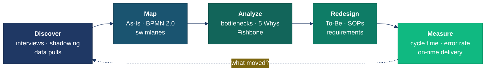
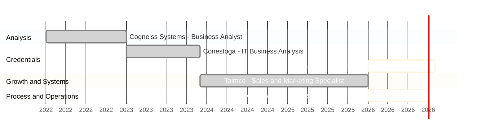

  

 

**I turn undocumented, tribal-knowledge workflows into measured processes — then make them faster.**

Estimators, shop floors, overseas suppliers, dev teams. Different rooms, same problem:  nobody can see where the work is stuck.

 

---

## How I Work

 

---

## Toolkit

**Process & Analysis**

**Data & Reporting**

**Delivery & Systems**

 

---

## Where I've Applied It

 

| | |
|:--|:--|
| **Manufacturing** | Quote-to-fabrication flow, overseas sourcing, shop-floor scheduling |
| **Distribution** | Lead-to-order handoffs, platform migration, catalogue data integrity |
| **Software** | Requirements, BRDs, test plans, integration troubleshooting |

 

---

## Sustainability & ESG

  

Standing that close to a metal shop, you notice how much material and carbon leaves as scrap.  
Currently formalising it — **Certificate in Sustainability & ESG, University of Toronto SCS** *(Nov 2026)*.

 

---

## Building With AI

  

*Most of what's pinned below started as "I wonder if I can build this in an afternoon."*  
I also design access control ladders and fall-protection systems for fun.

 

---

## Pinned Work

| Project | What It Does | Stack |
|:--|:--|:--|
| **SQL-Project** | Operational EDA — quantifying fulfilment delays and order-flow drop-off | `SQL` `SSMS` |
| **DataSource** | Data sourcing and cleaning reference for analysis workflows | `Python` `SQL` |

 

---

  

### *Not a career changer — a career adder.*

